## DASR

Unsupervised Degradation Representation Learning for Blind Super-Resolution

训练数据集：

**HR**:6000张flair大脑切片 

**LR**:由HR经过随机退化生成

测试图像来自同一3Dflair，但是不是训练数据,退化方式是real-esrgan复杂退化

迭代400轮

LR  HR   SR

**PSNR 19.86**

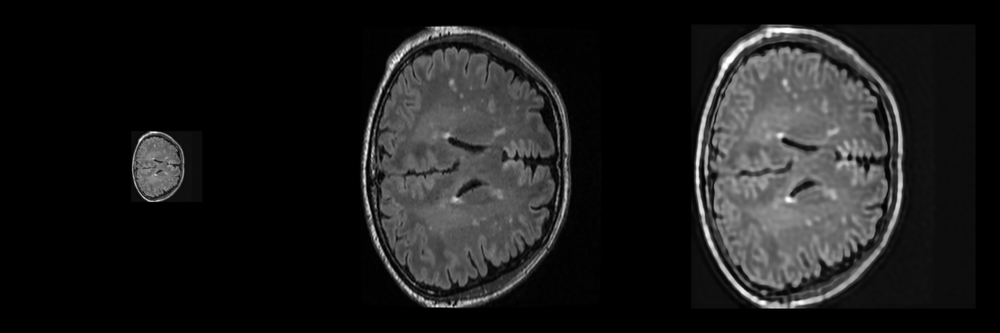

**PSNR 20.63**

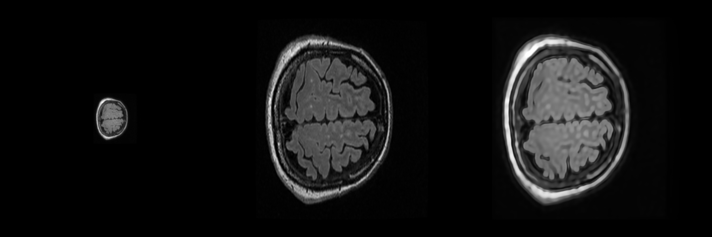

**PSNR 20.36**

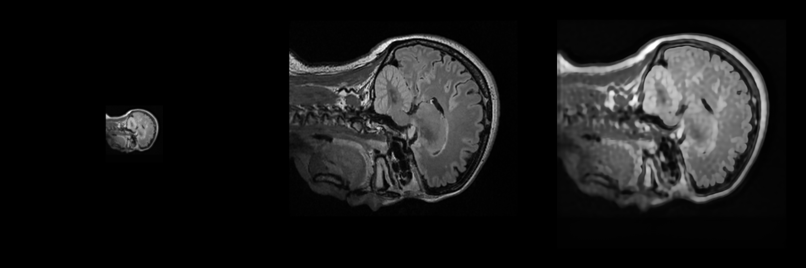

**PSNR 24.44**

**PSNR 20.38**

## BliMSR

训练数据集：

**HR**:6000张flair大脑切片 

**LR**:由HR经过Real-RSRGAN生成

原代码只能训练128→512

测试图像来自同一3Dflair，但是不是训练数据,退化方式也是real-esrgan复杂退化

LR  HR   SR

**PSNR 25.42**

**PSNR 24.07**

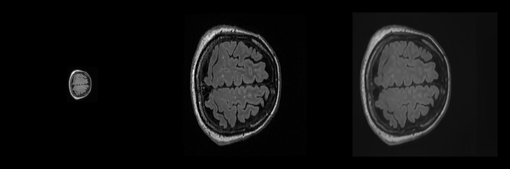

**PSNR 23.84**

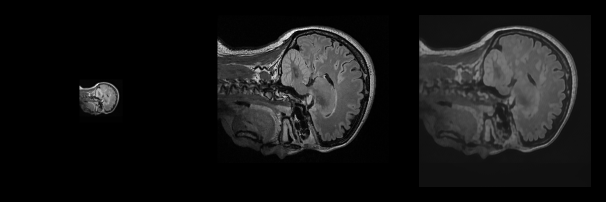

**PSNR 24.28**

**PSNR 25.15**

## MLINR

Super-resolution biomedical imaging via reference-free statistical implicit neural representation

**原图**

**平均模糊，两倍下采样,使用两种偏移**

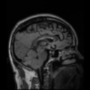

**迭代5000次,PNSR=32.11SSIM=0.965**

**迭代10000次，PNSR=32.51,SSIM=0.968**

迭代5000次大概需要10分组。

## SRO

Super-Resolution Neural Operator

作者实验中使用的数据以及下采样方式和LIFE一样，也都是自然图像数据集，将HR图像随机分块，用双三次下采样退化。损失函数是HR和SR图像的L2损失。为了让代码适应MRI图像，我把卷积的输入输出通道改成1，分块大小从120改成了40，加入了标准归一化。

**HR图像**

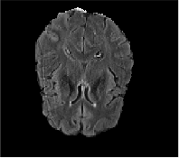

**HR图像双三次插值四倍下采样再上采样，PNSR 31.23**

## ARSSR

An Arbitrary Scale Super-Resolution Approach for 3D MR Images via Implicit Neural Representation

训练数据和原文的任务一一样，使用HCP-1200脑部数据集 测试数据集使用BraTS2020数据集中的Flair序列数据，用高斯模糊进行2倍下采样，再用训练好的模型进行上采样。

**左边原图，右边结果**

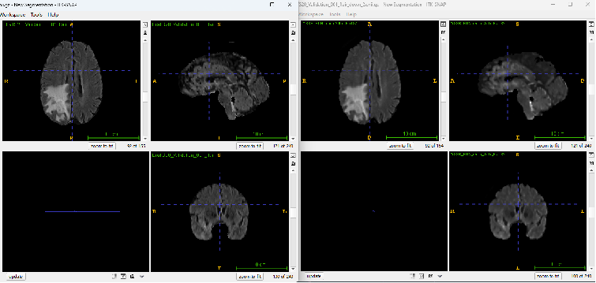

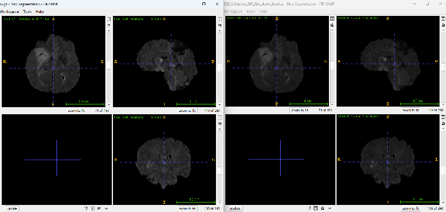

## MCSR

Single-subject Multi-contrast MRI Super-resolution via Implicit Neural Representations

使用的数据和原文一模一样，BraTS19

上面是超分结果，下面是原始的两个序列

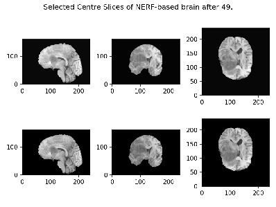

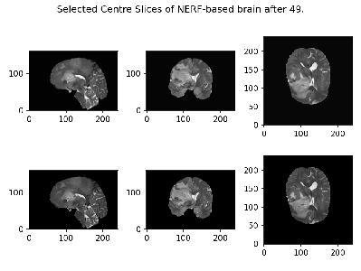

## SA-INR

Spatial Attention-based Implicit Neural Representation for Arbitrary Reduction of MRI Slice Spacing

选择一个数据分别以2，4，8倍下采样后再用训练的模型上采样

**原图**

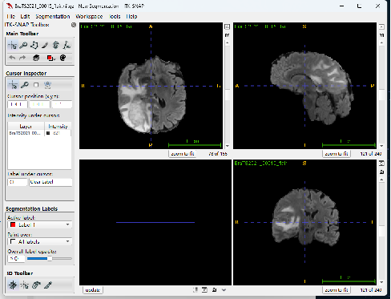

**两倍下采再上采**

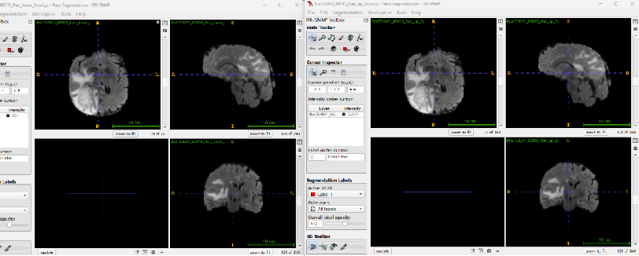

**四倍下采再上采**

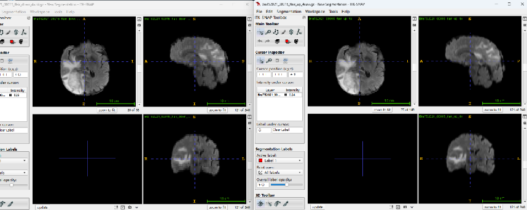

**八倍下采再上采**

